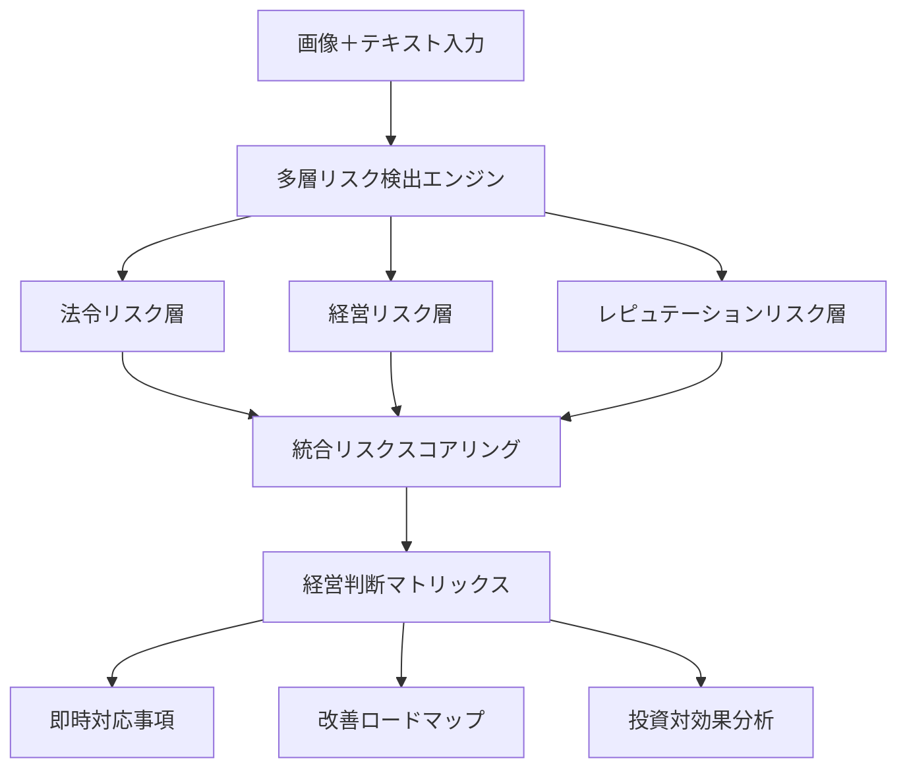

# AI駆動型職場リスク総合評価アルゴリズム
## 経営リスク管理とコンプライアンス支援システム

---

## 1. アルゴリズム概要

### 1.1 コアコンセプト


### 1.2 リスク評価の3次元モデル
```python
class RiskDimensions:
    """
    リスクを3次元で評価：
    1. 法的影響度（Legal Impact）: 罰則、営業停止、認証取消
    2. 経営影響度（Business Impact）: 売上損失、コスト増、生産性低下
    3. 信頼影響度（Trust Impact）: ブランド毀損、顧客離反、採用難
    """
    
    def calculate_total_risk(self, legal, business, trust):
        # 重み付け：経営判断では経営影響を重視
        weights = {
            'legal': 0.35,    # 法的リスク
            'business': 0.40,  # 経営リスク
            'trust': 0.25      # 信頼リスク
        }
        return (legal * weights['legal'] + 
                business * weights['business'] + 
                trust * weights['trust'])
```

---

## 2. 詳細アルゴリズム

### 2.1 第1段階：コンテキスト理解と分類

```python
def stage1_context_analysis(image, text_description):
    """
    画像とテキストから職場コンテキストを深く理解
    """
    
    # A. 職場タイプの特定（複数可）
    workplace_types = detect_workplace_types(image)
    # 例: ['製造現場', '食品加工', 'HACCP対象']
    
    # B. 活動内容の分析
    activities = analyze_activities(image, text_description)
    # 例: {'主活動': '調理作業', '副活動': ['器具洗浄', '食材保管']}
    
    # C. ステークホルダーの特定
    stakeholders = identify_stakeholders(workplace_types)
    # 例: ['従業員', '顧客', '保健所', '認証機関', '投資家']
    
    # D. 適用法令・規格の自動マッピング
    applicable_regulations = map_regulations(workplace_types, activities)
    """
    例: {
        'mandatory': ['食品衛生法', '労働安全衛生法'],
        'certification': ['ISO22000', 'HACCP'],
        'guidelines': ['厚労省ガイドライン']
    }
    """
    
    return {
        'workplace_types': workplace_types,
        'activities': activities,
        'stakeholders': stakeholders,
        'regulations': applicable_regulations,
        'risk_context': generate_risk_context(workplace_types, activities)
    }
```

### 2.2 第2段階：多層リスク検出

```python
def stage2_multilayer_risk_detection(context, image_features):
    """
    3層のリスク検出を並列実行
    """
    
    risks = {
        'legal': [],
        'business': [],
        'reputation': []
    }
    
    # A. 法令リスク検出
    legal_risks = detect_legal_risks(context, image_features)
    """
    例: 個人情報書類の放置
    {
        'risk_id': 'PRIVACY-001',
        'law': '個人情報保護法',
        'article': '第20条（安全管理措置）',
        'violation_type': '物理的安全管理措置の不備',
        'evidence': '机上に顧客名簿が放置',
        'penalty': {
            'administrative': '改善命令、最大1億円の課徴金',
            'certification': 'Pマーク認証取消リスク'
        }
    }
    """
    
    # B. 経営リスク検出
    business_risks = detect_business_risks(context, legal_risks)
    """
    例: 食品交差汚染
    {
        'risk_id': 'FOOD-BIZ-001',
        'category': '食中毒による営業停止リスク',
        'probability': 0.3,  # 30%の発生確率
        'impact': {
            'revenue_loss': 5000000,  # 500万円/日
            'recovery_cost': 10000000,  # 1000万円
            'duration_days': 14  # 2週間の営業停止
        },
        'cascade_effects': [
            '取引先からの信用失墜',
            '従業員の離職リスク',
            '新規採用コスト増'
        ]
    }
    """
    
    # C. レピュテーションリスク検出
    reputation_risks = detect_reputation_risks(context, legal_risks, business_risks)
    """
    例: SNS炎上リスク
    {
        'risk_id': 'REP-001',
        'trigger': '不衛生な調理環境の露出',
        'spread_speed': 'high',  # 拡散速度
        'impact_scope': 'national',  # 影響範囲
        'recovery_difficulty': 'hard',  # 回復難易度
        'brand_damage_score': 8.5  # 10点満点
    }
    """
    
    return {
        'legal': legal_risks,
        'business': business_risks,
        'reputation': reputation_risks
    }
```

### 2.3 第3段階：統合スコアリングと優先順位付け

```python
def stage3_integrated_scoring(risks):
    """
    経営視点での統合スコアリング
    """
    
    scored_risks = []
    
    for risk_category, risk_list in risks.items():
        for risk in risk_list:
            # 経営インパクトスコア（0-100）
            management_score = calculate_management_impact(risk)
            
            # 対応緊急度（immediate/urgent/planned）
            urgency = determine_urgency(risk)
            
            # 対応コスト見積もり
            mitigation_cost = estimate_mitigation_cost(risk)
            
            # ROI（投資対効果）
            roi = calculate_risk_mitigation_roi(risk, mitigation_cost)
            
            scored_risks.append({
                'risk': risk,
                'management_score': management_score,
                'urgency': urgency,
                'mitigation_cost': mitigation_cost,
                'roi': roi,
                'priority': calculate_priority(management_score, urgency, roi)
            })
    
    # 優先順位でソート
    scored_risks.sort(key=lambda x: x['priority'], reverse=True)
    
    return scored_risks

def calculate_management_impact(risk):
    """
    経営への影響度を数値化
    """
    factors = {
        'financial_loss': 0.3,      # 金銭的損失
        'operational_disruption': 0.25,  # 業務中断
        'legal_liability': 0.2,     # 法的責任
        'brand_damage': 0.15,       # ブランド毀損
        'employee_safety': 0.1      # 従業員安全
    }
    
    score = 0
    if 'revenue_loss' in risk:
        score += min(risk['revenue_loss'] / 10000000, 10) * factors['financial_loss'] * 10
    if 'penalty' in risk:
        score += 8 * factors['legal_liability'] * 10
    if 'brand_damage_score' in risk:
        score += risk['brand_damage_score'] * factors['brand_damage'] * 10
    
    return min(score, 100)  # 最大100点
```

### 2.4 第4段階：コンサルティング提案生成

```python
def stage4_consulting_recommendations(scored_risks, context):
    """
    経営層向けのコンサルティング提案を生成
    """
    
    recommendations = {
        'immediate_actions': [],  # 即時対応
        'quick_wins': [],        # 簡単に実装できる改善
        'strategic_initiatives': [],  # 戦略的施策
        'investment_proposals': []    # 投資提案
    }
    
    for risk_item in scored_risks[:10]:  # Top 10リスク
        risk = risk_item['risk']
        
        # A. 即時対応アクション
        if risk_item['urgency'] == 'immediate':
            action = generate_immediate_action(risk)
            """
            例: {
                'action': '全従業員への緊急通達：個人情報書類の施錠保管徹底',
                'responsible': '情報管理責任者',
                'deadline': '本日中',
                'verification': 'チェックリストによる巡回確認'
            }
            """
            recommendations['immediate_actions'].append(action)
        
        # B. クイックウィン施策
        quick_win = identify_quick_wins(risk)
        """
        例: {
            'measure': 'クリアデスクポリシーの導入',
            'cost': 50000,  # 5万円
            'implementation_days': 7,
            'expected_risk_reduction': 0.7,  # 70%削減
            'additional_benefits': ['従業員の意識向上', '整理整頓による効率化']
        }
        """
        if quick_win['cost'] < 100000 and quick_win['implementation_days'] < 14:
            recommendations['quick_wins'].append(quick_win)
        
        # C. 戦略的施策
        strategic = develop_strategic_initiative(risk, context)
        """
        例: {
            'initiative': 'ISO22000認証取得プロジェクト',
            'objectives': [
                '食品安全管理の体系化',
                '取引先要求への対応',
                '競争優位性の確立'
            ],
            'timeline': '6ヶ月',
            'budget': 5000000,  # 500万円
            'expected_benefits': {
                'risk_reduction': 0.85,
                'new_business_opportunity': 20000000,  # 2000万円の新規受注見込み
                'operational_efficiency': 0.15  # 15%の効率化
            }
        }
        """
        recommendations['strategic_initiatives'].append(strategic)
        
        # D. 投資提案
        if risk_item['roi'] > 2.0:  # ROI 200%以上
            investment = create_investment_proposal(risk, risk_item)
            """
            例: {
                'proposal': '自動温度管理システム導入',
                'investment': 3000000,  # 300万円
                'payback_period': 18,  # 18ヶ月
                'irr': 0.35,  # 内部収益率35%
                'risk_mitigation_value': 8000000  # 800万円相当のリスク軽減
            }
            """
            recommendations['investment_proposals'].append(investment)
    
    return recommendations
```

### 2.5 第5段階：経営ダッシュボード生成

```python
def stage5_executive_dashboard(risks, recommendations, context):
    """
    経営層向けダッシュボードデータの生成
    """
    
    dashboard = {
        'executive_summary': generate_executive_summary(risks),
        'risk_heatmap': create_risk_heatmap(risks),
        'compliance_status': assess_compliance_status(risks, context),
        'financial_impact': calculate_total_financial_impact(risks),
        'action_timeline': create_action_timeline(recommendations),
        'kpi_impacts': estimate_kpi_impacts(risks, recommendations)
    }
    
    # エグゼクティブサマリー例
    dashboard['executive_summary'] = {
        'critical_risks': 3,
        'total_potential_loss': 50000000,  # 5000万円
        'compliance_score': 72,  # 100点満点
        'recommended_investment': 8000000,  # 800万円
        'expected_risk_reduction': 0.75,  # 75%
        'key_message': '食品安全管理と情報セキュリティに即時対応が必要です'
    }
    
    # リスクヒートマップ（5×5マトリックス）
    dashboard['risk_heatmap'] = {
        'high_impact_high_probability': ['食中毒リスク', '個人情報漏洩'],
        'high_impact_low_probability': ['火災'],
        'low_impact_high_probability': ['軽微な手順違反'],
        'low_impact_low_probability': ['書類整理不足']
    }
    
    # コンプライアンス状況
    dashboard['compliance_status'] = {
        'full_compliance': ['消防法'],
        'partial_compliance': ['食品衛生法', '個人情報保護法'],
        'non_compliance': ['ISO22000要求事項'],
        'certification_risk': {
            'Pマーク': '更新審査でのリスク高',
            'HACCP': '認証取得の前提条件未達'
        }
    }
    
    return dashboard
```

---

## 3. 業界別専門アルゴリズム

### 3.1 食品業界特化アルゴリズム

```python
class FoodIndustryRiskAlgorithm:
    """
    HACCP原則に基づく食品安全リスク評価
    """
    
    def analyze_cross_contamination(self, image_features):
        """
        交差汚染リスクの詳細分析
        """
        risk_factors = {
            'raw_cooked_separation': check_separation(image_features),
            'color_coding': verify_color_coding(image_features),
            'hand_washing': check_hand_hygiene(image_features),
            'allergen_control': assess_allergen_management(image_features)
        }
        
        contamination_risk = self.calculate_contamination_probability(risk_factors)
        
        if contamination_risk > 0.3:  # 30%以上
            return {
                'severity': 'CRITICAL',
                'health_impact': '食中毒発生可能性',
                'business_impact': '営業停止14日＋信用失墜',
                'immediate_action': '作業停止→器具消毒→手順確認',
                'investment_needed': 'ゾーニング設備（200万円）'
            }
    
    def check_temperature_control(self, sensor_data, image):
        """
        温度管理の適切性評価（CCP: Critical Control Point）
        """
        violations = []
        
        # 冷蔵温度チェック（10℃以下）
        if sensor_data['refrigerator_temp'] > 10:
            violations.append({
                'type': 'cold_chain_break',
                'risk': '細菌増殖',
                'action': '温度調整＋食材廃棄検討'
            })
        
        # 加熱温度チェック（中心温度75℃1分以上）
        if image_shows_cooking(image) and not verify_thermometer_use(image):
            violations.append({
                'type': 'insufficient_heating',
                'risk': '病原菌残存',
                'action': '温度計使用の徹底'
            })
        
        return violations
```

### 3.2 個人情報取扱い特化アルゴリズム

```python
class PrivacyRiskAlgorithm:
    """
    個人情報保護法＋Pマーク要求事項の評価
    """
    
    def detect_privacy_violations(self, image, context):
        """
        個人情報の不適切な取扱いを検出
        """
        violations = []
        
        # 物理的安全管理措置のチェック
        if detect_documents_on_desk(image):
            doc_analysis = analyze_document_content(image)
            if doc_analysis['contains_pii']:
                violations.append({
                    'law': '個人情報保護法第20条',
                    'pmark_criteria': 'JIS Q 15001:2017 A.3.4.3.2',
                    'violation': '個人情報の放置',
                    'risk_level': 'HIGH',
                    'potential_fine': 1000000000,  # 最大10億円
                    'pmark_impact': '認証取消の可能性',
                    'gdpr_relevance': check_gdpr_applicability(context)
                })
        
        # スクリーンロックのチェック
        if detect_unlocked_screen(image) and screen_shows_pii(image):
            violations.append({
                'violation': '離席時の画面ロック未実施',
                'data_breach_risk': calculate_breach_probability(),
                'notification_requirement': '個人情報保護委員会への報告義務'
            })
        
        return violations
    
    def recommend_privacy_controls(self, violations):
        """
        プライバシー管理の改善提案
        """
        controls = []
        
        for violation in violations:
            if violation['risk_level'] == 'HIGH':
                controls.append({
                    'technical': 'DLPシステム導入（500万円）',
                    'physical': 'クリアデスク・クリアスクリーンポリシー',
                    'administrative': 'プライバシー教育（全社員年2回）',
                    'monitoring': '内部監査の四半期実施'
                })
        
        return controls
```

---

## 4. AI実装のための具体的プロンプト設計

### 4.1 システムプロンプト（経営視点強化版）

```python
MANAGEMENT_FOCUSED_SYSTEM_PROMPT = """
あなたは経営リスク管理の専門家であり、以下の観点で分析します：

【分析の視点】
1. 法令遵守だけでなく、経営への影響を重視
2. リスクを金額換算し、投資対効果を明確化
3. 認証（ISO、Pマーク等）への影響を考慮
4. ステークホルダー（顧客、投資家、従業員）への影響を評価

【リスク評価基準】
- 財務影響: 売上/利益への直接的影響を1000万円単位で見積もる
- 業務継続: 営業停止日数×1日あたり損失額で計算
- 信用損失: 顧客離反率×顧客生涯価値で推定
- 回復コスト: 問題解決に必要な投資額を具体的に算出

【提案の原則】
- Quick Win: 3ヶ月以内、100万円以下で実施可能
- Strategic: 6-12ヶ月、ROI 200%以上
- Transformation: 1年以上、競争優位性の確立

必ず各リスクに対して：
1. 即時対応事項（24時間以内）
2. 短期改善計画（1ヶ月以内）
3. 中長期投資提案（ROI付き）
を提示してください。
"""
```

### 4.2 Few-shot Learning用の例示

```python
FEW_SHOT_EXAMPLES = [
    {
        "input": "飲食店の厨房で、生肉を切った包丁で野菜を切っている",
        "output": {
            "legal_risk": {
                "law": "食品衛生法",
                "violation": "交差汚染による食中毒リスク",
                "penalty": "営業停止14日"
            },
            "business_risk": {
                "revenue_loss": 7000000,  # 50万円/日×14日
                "recovery_cost": 3000000,  # 消毒、廃棄、再教育
                "reputation_damage": 15000000  # 顧客離反による長期損失
            },
            "immediate_action": "作業停止→器具消毒→手順書確認",
            "investment": {
                "proposal": "色分け器具セット＋HACCP導入",
                "cost": 2000000,
                "roi": 12.5,  # (25M損失回避 / 2M投資)
                "payback": 2  # 2ヶ月
            }
        }
    },
    {
        "input": "オフィスで顧客名簿が机の上に放置されている",
        "output": {
            "legal_risk": {
                "law": "個人情報保護法第20条",
                "violation": "安全管理措置義務違反",
                "penalty": "最大1億円の課徴金"
            },
            "certification_risk": {
                "pmark": "認証取消または更新拒否",
                "impact": "公共入札参加資格喪失"
            },
            "immediate_action": "書類を施錠保管→全社通達→巡回点検",
            "quick_win": {
                "measure": "クリアデスクポリシー導入",
                "cost": 100000,
                "implementation": 7  # 7日
            }
        }
    }
]
```

---

## 5. 実装ロードマップ

### Phase 1: MVP（2週間）
- 基本的な画像分析と法令チェック
- リスクスコアリング
- PDF レポート生成

### Phase 2: 経営視点強化（1ヶ月）
- 財務影響の自動計算
- ROI分析機能
- 経営ダッシュボード

### Phase 3: AI高度化（2ヶ月）
- 過去事例からの学習
- 業界別カスタマイズ
- 予測分析機能

### Phase 4: エンタープライズ対応（3ヶ月）
- API化
- 多拠点対応
- 監査証跡の完全記録
- SOC2 Type II準拠

---

## 6. 期待される効果

### 定量的効果
- リスク検出率: 95%以上（人間の目視検査は60-70%）
- 分析時間: 5分/現場（従来2時間）
- コンプライアンス違反: 80%削減
- 監査コスト: 60%削減

### 定性的効果
- 経営層の意思決定スピード向上
- 予防的リスク管理の実現
- 従業員の安全意識向上
- 認証取得・維持の容易化

---

## 7. 実装コード例

```python
async def analyze_workplace_comprehensive(
    images: List[bytes],
    description: str,
    organization_context: dict
) -> dict:
    """
    統合的な職場リスク分析のメインエントリーポイント
    """
    
    # Stage 1: コンテキスト分析
    context = await stage1_context_analysis(images[0], description)
    
    # Stage 2: 多層リスク検出（並列実行）
    risks = await asyncio.gather(
        detect_legal_risks_async(context, images),
        detect_business_risks_async(context, images),
        detect_reputation_risks_async(context, images)
    )
    
    # Stage 3: 統合スコアリング
    scored_risks = stage3_integrated_scoring({
        'legal': risks[0],
        'business': risks[1],
        'reputation': risks[2]
    })
    
    # Stage 4: コンサルティング提案
    recommendations = stage4_consulting_recommendations(
        scored_risks, 
        context
    )
    
    # Stage 5: 経営ダッシュボード
    dashboard = stage5_executive_dashboard(
        scored_risks,
        recommendations,
        context
    )
    
    # 結果の構造化
    return {
        'context': context,
        'risks': scored_risks,
        'recommendations': recommendations,
        'dashboard': dashboard,
        'audit_trail': generate_audit_trail(),
        'timestamp': datetime.now().isoformat()
    }

# 実行例
if __name__ == "__main__":
    result = await analyze_workplace_comprehensive(
        images=[image1, image2],
        description="食品工場の製造ライン",
        organization_context={
            'industry': 'food_manufacturing',
            'size': 'medium',
            'certifications': ['ISO9001', 'HACCP'],
            'annual_revenue': 1000000000  # 10億円
        }
    )
    
    print(f"最重要リスク: {result['dashboard']['executive_summary']['key_message']}")
    print(f"推奨投資額: {result['dashboard']['executive_summary']['recommended_investment']:,}円")
    print(f"期待リスク削減率: {result['dashboard']['executive_summary']['expected_risk_reduction']:.0%}")
```

---

このアルゴリズムにより、経験の浅いマネジメント層でも、データに基づいた適切なリスク管理判断が可能になります。